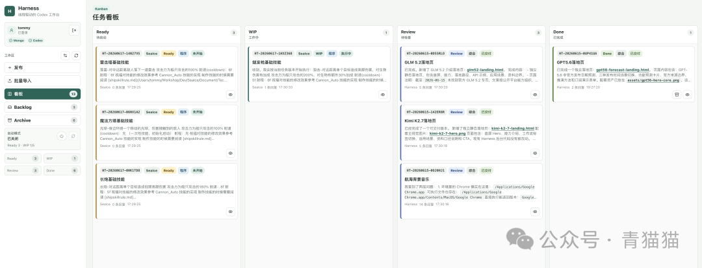

# Codex Kanban Web UI

[](https://github.com/lesstommy/codex-kanban-web-ui/actions/workflows/ci.yml)
[](LICENSE)
[](CHANGELOG.md)

一个本地优先、由 Codex 驱动的 Agent 任务工作台。它把分散在 Codex 对话列表中的工作，组织成可追踪的任务卡片、回复流和自动化 Kanban。

> 当前版本为 `0.1.0-alpha`，面向本地单用户开发环境。这是一个独立开源项目，不是 OpenAI 官方产品，也不代表 OpenAI。Codex 是 OpenAI 的产品与商标。



[产品介绍](docs/product-overview.md) · [设计概览](docs/design-overview.md) · [技术架构](docs/technical-architecture.md) · [CLI Agent 协议](docs/cli-agent.md)

## 为什么做 Harness

Codex 擅长执行具体工作，但当 Agent 开始长期参与真实项目，新的瓶颈会变成：任务散落在线程里、过程难以集中检查、重复流程依赖人工启动、团队约定无法稳定进入每次执行。

Harness 不替代 Codex。它通过本地 `codex app-server` 调度真实 Codex thread/turn，在上层补上一套项目工作流：

- 一项任务对应一个 Harness Thread、一张卡片和一个 Codex 线程
- 用户任务、Codex ACK、执行结果和后续意见集中在同一条回复流中
- Ready / WIP / Review / Done 表达人和 Agent 之间的工作交接
- Backlog、批量导入、CLI 和自动模式负责组织与批量启动任务
- 预设项目把本地工作目录和不同 Role 的初始化要求绑定起来

## 工作方式

```text
发布任务 -> Ready -> WIP -> Codex 执行 -> Review -> Done -> Archive
                    ^                    |
                    |---- 回复修改意见 ---|
```

发布任务只会创建 queued run，不会立即调用 Codex。用户确认拖入 WIP，或由自动模式从当前 Ready 栏领取任务后，后台 worker 才会启动执行。Codex 完成后卡片进入 Review；如果需要修改，在卡片内回复意见并重新进入 WIP，系统会继续对应的 Codex 线程。

## 核心能力

| 能力 | 说明 |
| --- | --- |
| 卡片式任务 | 使用独立业务任务 ID 管理任务，不以 MongoDB `_id` 作为用户标识 |
| Feeds 式回复 | 用户和 Codex 的 ACK、结果、补充意见都保留在同一任务中 |
| Kanban 工作流 | Ready / WIP / Review / Done 分离待启动、执行、人工检查和完成阶段 |
| 可观测长任务 | 显示运行计时、最近事件、heartbeat、长时间无进展和完成耗时 |
| 自动模式 | 按可配置间隔从 Ready 补充 WIP，并限制同时工作的任务数量 |
| 预设项目与 Role | 绑定本地目录，并为 `se`、`art`、`design`、`music`、`general` 配置首次执行要求 |
| 批量接入 | 支持 CSV 导入 Backlog，以及供 Codex 或其他 Agent 使用的 CLI/API |
| 本地优先 | 数据保存在本地 MongoDB，Codex 通过本机 CLI 登录和 app-server 运行 |

## 当前范围

- 当前是 macOS 优先的本地单用户版本，不包含团队空间和细粒度成员权限。
- 跨卡片总结、自动拆解文档和外部通知仍属于后续能力；当前版本提供可查询的结构化线程、CLI 和 API 基础。
- Harness 可以读取选定工作区并让 Codex 修改其中的文件。默认只监听 `127.0.0.1`，不要在未配置认证和安全网络边界时直接暴露到公网。

## 本地准备

运行环境：

- Node.js `^20.19.0` 或 `>=22.12.0`
- MongoDB Community 8.x，或其他可用的 MongoDB replica set
- 已安装并登录的 Codex CLI；`codex` 默认从 `PATH` 查找

当前发布流程优先支持 macOS。核心 Node 服务不依赖 Homebrew，但仓库自带的 MongoDB 安装和后台进程脚本使用 Bash 与 macOS/Homebrew 工具链。

验证 Codex CLI：

```bash
codex --version
codex login status
```

macOS 可以通过 Homebrew 安装 MongoDB Community：

```bash
npm run mongo:install
npm run mongo:start
npm run mongo:init
```

如果你已经有 MongoDB，可以直接设置 `.env`：

```bash
cp .env.example .env
```

MongoDB 启动后可以先检查本机依赖：

```bash
npm run doctor
```

## 开发运行

```bash
npm install
npm start
```

默认地址：

- Web: http://127.0.0.1:5173
- API: http://127.0.0.1:4317

`npm start` 会依次执行：

- 启动本地 MongoDB
- 初始化 MongoDB replica set
- 检查 Node、Codex 登录、MongoDB 和本地数据目录
- 构建前端
- 启动 Harness API 和本地预览 Web 服务

开发时需要热更新，可以使用：

```bash
npm run dev
```

如果已经自行准备好 MongoDB，并希望直接运行构建后的本地服务：

```bash
npm run build
npm run serve
```

后台启动：

```bash
npm run start:bg
npm run status
npm run stop
```

后台启动会把 Harness API 和 Web 放到后台运行，日志写入 `.local/logs/harness.log`，pid 写入 `.local/harness.pid`。`npm run stop` 只停止 Harness API/Web，不停止本地 MongoDB。

## CLI / Agent 接入

除了 Web UI，Harness 现在也提供后台 CLI，适合让 Codex 或其他 Agent 批量创建和推进任务。

如果是给其他 Agent 集成，完整协议说明见：

- [CLI Agent 协议](docs/cli-agent.md)

先在服务端配置一个 Bearer token：

```bash
HARNESS_API_TOKEN=replace-with-a-long-random-token
HARNESS_API_TOKEN_NAME=codex-cli
```

服务启动时会把它 upsert 到 MongoDB `service_accounts` 集合。CLI 默认读取同名环境变量，也可以显式传 `--token`。

命令入口：

```bash
./bin/harness --help
# 或
npm run harness -- --help
```

常用命令：

```bash
./bin/harness task create \
  --folder /abs/project/path \
  --preset-project-id example-app \
  --name "实现登录页" \
  --role se \
  --body "实现邮箱登录页和基础校验" \
  --external-task-key US-101 \
  --token "$HARNESS_API_TOKEN"

./bin/harness task import \
  --file ./tasks.jsonl \
  --folder /abs/project/path \
  --preset-project-id example-app \
  --token "$HARNESS_API_TOKEN"

./bin/harness task list --token "$HARNESS_API_TOKEN"
./bin/harness task show HT-20260616-XXXXXXX --token "$HARNESS_API_TOKEN"
./bin/harness task start HT-20260616-XXXXXXX --token "$HARNESS_API_TOKEN"
./bin/harness task reply HT-20260616-XXXXXXX --body "继续下一步" --token "$HARNESS_API_TOKEN"
./bin/harness task heartbeat HT-20260616-XXXXXXX --token "$HARNESS_API_TOKEN"
./bin/harness settings get --token "$HARNESS_API_TOKEN"
```

`task import` 使用 `JSONL`，每行一个任务对象。默认会创建为 `Ready + hidden`，也就是进入 Backlog 浏览，不会直接挤满 Ready 栏：

`--preset-project-id` 是可选参数。传入后任务会记录对应预设项目，卡片上显示项目名，并在首次启动时按该预设项目和任务 role 追加初始化字段；不传则只使用 `--folder`，不会追加 Role 初始化字段。设置中的线程初始化基础 Prompt 也只在首次启动时加入，不会在回复 run 中重复追加。

```jsonl
{"name":"登录页","role":"se","body":"实现邮箱登录页","externalTaskKey":"US-101"}
{"name":"主界面背景音乐","role":"music","body":"制作 1 分钟循环背景音乐","externalTaskKey":"MUSIC-001"}
```

如果同一个 Bearer token 再次提交相同的 `externalTaskKey`，Harness 会命中已有卡片，返回 `created=false`，不会重复建任务。

第一版默认真实调用 Codex app-server。可选配置：

```bash
CODEX_MODEL=gpt-5.5
CODEX_REASONING_EFFORT=low
CODEX_TURN_TIMEOUT_MS=0
CODEX_WORKER_CONCURRENCY=5
```

`CODEX_MODEL` 和 `CODEX_REASONING_EFFORT` 不设置时会使用本机 Codex 配置。
`CODEX_TURN_TIMEOUT_MS=0` 表示不对整个 Codex turn 设置 wall-clock 超时；Harness 只保留 app-server 握手类 RPC 的短超时。需要本地调试超时行为时，才设置为正整数毫秒。
`CODEX_WORKER_CONCURRENCY` 控制本地 worker 并发执行的 Codex run 数量，默认 5，最大值固定封顶为 5。

## 登录与公网暴露

默认服务只监听 `127.0.0.1`，本地开发不强制登录。设置下面任一密码配置后，认证会自动启用：

```bash
HARNESS_AUTH_USERNAME=admin
HARNESS_AUTH_PASSWORD=your-password
HARNESS_SESSION_SECRET=replace-with-a-long-random-secret
```

也可以用 `HARNESS_AUTH_PASSWORD_HASH` 保存 `scrypt$salt$hash` 形式的密码哈希。服务启动时会用这些 bootstrap 配置 upsert MongoDB `accounts` 集合里的管理员账户；运行时登录校验以数据库账户为准。公网或反向代理暴露前必须启用登录；如果把 `SERVER_HOST` 设成 `0.0.0.0`，但没有设置登录密码，服务会拒绝启动。HTTPS 场景建议同时设置：

```bash
HARNESS_COOKIE_SECURE=true
```

登录失败会按客户端地址限流，默认 `HARNESS_LOGIN_MAX_ATTEMPTS=8`、`HARNESS_LOGIN_WINDOW_MS=300000`。

Harness 能浏览本机目录、读取线程目录中的文件，并让 Codex 修改选定工作区。默认只应监听 `127.0.0.1`。远程使用优先通过 SSH、VPN 或零信任网络访问；不要仅依赖密码把服务直接暴露到公网。

## 验证

```bash
npm run lint
npm run build
npm run test
npm audit
```

测试使用 `mongodb-memory-server` 创建临时 replica set，并通过真实 `codex app-server` 调用 Codex。

`npm test` 会运行真实 Codex 端到端用例。GitHub 普通 CI 使用 `npm run test:ci`，只跳过这一项需要本机 Codex 登录的用例，其余 API、数据库和状态流测试照常运行；Codex E2E 路径不使用测试替身。维护者可以在已登录 Codex 的 macOS self-hosted runner 上手动触发 `Codex E2E` workflow。

版本变化见 [CHANGELOG.md](CHANGELOG.md)。

## 参与项目

- 使用与问题咨询：[SUPPORT.md](SUPPORT.md)
- 贡献代码：[CONTRIBUTING.md](CONTRIBUTING.md)
- 社区行为准则：[CODE_OF_CONDUCT.md](CODE_OF_CONDUCT.md)
- 安全问题报告：[SECURITY.md](SECURITY.md)

## License

本项目使用 [Apache License 2.0](LICENSE)。
