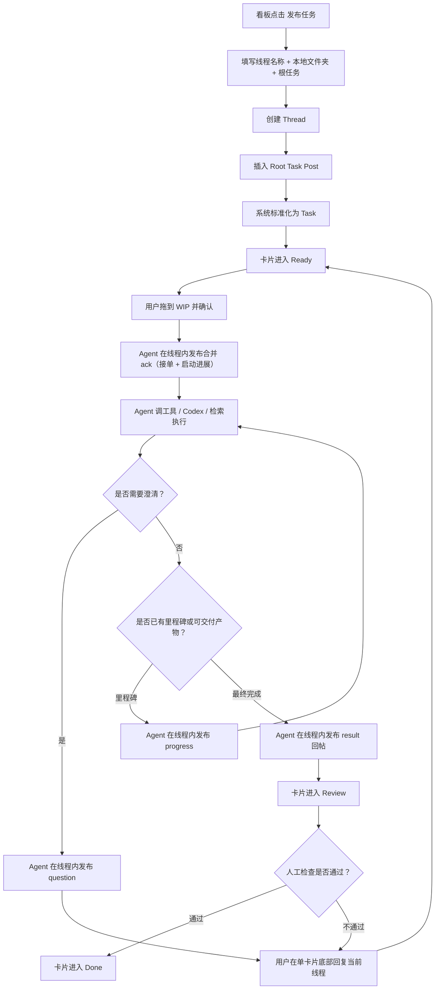

# Codex Kanban Web UI 设计概览

## 1. 产品定位

这个产品不是普通聊天界面，而是一个短消息驱动的工作系统：用户发布轻量任务请求，Agent 通过线程化、带状态的回帖来执行工作。

最新结构回到以 `Thread` 为最上层：

1. 用户在看板中点击“发布任务 / 新建线程”。
2. 用户为线程选择本地文件夹、设定线程名称、选择任务 Role，并写下不超过 500 个字符的任务请求。
3. 系统创建一个新的线程；这个线程就是一个任务，也是一张工作卡片，状态进入 Ready。
4. 用户将卡片拖入 WIP 并确认后，Agent 才在这个线程内给出接单确认、进展、追问、结果或失败。
5. Codex 完成后卡片进入 Review，人工检查通过后进入 Done；不通过时先在单卡片内回复修改意见，再拖回 WIP。
6. 用户如果要评价 Codex 回复、补充要求、继续推进同一项工作，应在单卡片视图底部回复当前线程。

500 个字符的限制用于约束任务边界，使每条消息成为一个聚焦的小决策包，避免在单张卡片中堆积过长的规格说明。

## 2. 设计目标

用一种更轻的工作协议，替代大量早期和中期的规格沟通：

- 比聊天更正式
- 比完整规格文档更轻
- 更适合在执行过程中持续变动、不断修正的任务

这里的基本假设是：用户往往不需要一开始就把一切都定义完整。他们只需要明确当前目标、当前约束和当前期望输出，剩余信息可以在线程中边做边发现、边做边澄清、边做边收敛。

## 3. 核心设计原则

### 3.1 Thread 是最上层工作边界

线程是 Harness 的一级组织单位。每个线程至少包含：

- 业务任务 ID
- 线程名称
- 任务 Role：程序 / 美术 / 策划 / 音乐 / 综合
- 本地线程文件夹
- 根任务帖子
- 后续用户回复
- Agent 回复
- 当前任务状态

线程不是项目下的子对象，而是任务本体。一个线程就是一个任务，也是界面上的一张工作卡片。

业务任务 ID 由 Harness 自己生成，例如 `HT-20260615-0ABC123`，用于 UI 展示、MongoDB 唯一索引和 API 查询。它不是 MongoDB `_id`，也不应该把数据库 `_id` 当成人可读任务编号。

### 3.2 新建线程就是发布任务

由于任务和线程一一绑定，左侧导航里的“新建线程”本质上就是发布新任务。

创建线程时用户需要提供：

- 线程名称
- 任务 Role
- 本地文件夹
- 初始任务内容
- 可选附件或上下文引用

创建成功后，系统只创建 queued run，不立即启动 Codex。任务状态进入 Ready。Ready 栏默认显示最近 10 条和手动显示项；Backlog 入口可以浏览所有 Ready 任务。只有用户把 Ready 卡片拖入 WIP 并确认后，Harness 才启动该线程对应的 Codex 执行。

自动模式是对人工拖入 WIP 的补位机制：开启时后端立即检查一次当前 Ready 栏，之后按设置中的 1 到 10 分钟间隔循环检查，默认间隔为 5 分钟。当 WIP 低于设置中的并发上限时，系统从 Ready 栏启动 queued run，直到 WIP 达到上限或 Ready 栏为空。自动模式不直接扫描 Backlog 全量。后台 worker 支持 1 到 5 个 Codex run 并发执行，默认并发为 5，固定上限为 5。

### 3.3 Kanban 只管理任务阶段

Kanban 是线程工作卡片的管理视图，不改变底层对象关系。

Kanban 主视图只显示当前工作面四列：

- `Ready`：任务已经发布，等待人工确认启动
- `WIP`：任务已经进入工作区，可能正在由 Codex 执行、等待 worker slot、等待用户补充，或失败后等待再次启动
- `Review`：Codex 已交付结果，等待人工检查
- `Done`：人工确认完成

同时存在两个独立浏览入口：

- `Backlog`：展示所有 `boardStage=ready` 的待启动任务，包括已经显示在 Ready 栏中的任务
- `Archive`：展示所有 `boardStage=done` 的完成任务，包括已经显示在 Done 栏中的任务

这些阶段使用独立的 `boardStage` 表示，不和 `thread.status`、`run.status` 或 `post.status` 混用。Ready/Done 是否显示在看板栏由 `boardDisplay=auto|shown|hidden` 保存。执行状态继续表达 Codex 的真实运行事实；看板阶段表达人工工作流。

### 3.4 右侧工作区只回复当前线程

右侧工作区不是全局 feed，也不承担“发布新任务”的职责。

它只展示当前选中的工作卡片：

- 顶部是线程标题、本地文件夹和轻量总体状态
- 中间是根任务和回复流
- 底部是固定的回复输入栏

用户在底部输入内容时，语义永远是“继续当前线程”，不是创建新任务。

### 3.5 短帖是当前有效指令

500 字帖子不是压缩版规格，而是当前时刻最小、最稳定的一条工作指令。

每条帖子最好回答三个问题：

- 现在要做什么？
- 现在最重要的约束是什么？
- 现在期望得到什么输出？

根帖子启动任务，后续回复持续修正任务。真正承载任务定义的是整个线程，而不是单条根消息。

### 3.6 状态跟随回复流

每一条重要回复都应该代表一次明确的状态推进。

状态不应该只显示在页面顶部，也不应该只显示在卡片外壳上。更合理的结构是：

- 线程顶部只显示轻量聚合状态，不放大块运行状态面板
- 每条 Agent 回复正文后面显示它对应的阶段状态
- 用户回复可以显示它触发的后续状态，例如 `queued`、`working` 或 `waiting`
- 运行计时、完成耗时、heartbeat、最近事件和长时间运行提示跟随当前执行中的 Codex 回帖展示，尤其是初始 `ack` 回帖

这样用户能看清楚：哪一条回复触发了哪一次执行，以及当前任务为什么处在这个状态。

### 3.7 Agent 应先执行确定部分

只要任务中已经有足够清晰的一部分，Agent 就不应机械地等待“100% 完整需求”。

它应该：

- 先执行没有歧义的部分
- 明确暴露自己的假设
- 只在被阻塞或猜测代价过高时提问

### 3.8 回帖必须承载状态，而不只是拟人感

Agent 的回帖可以自然，但不能只是像人在聊天。每一条重要回复都应该代表一次明确的机器状态变化。

一句友好的话只有在同时告诉系统“发生了什么变化”时，才真正有产品价值。

### 3.9 Codex 结果直接放在回帖中

用户输入仍然保持 500 字限制，但 Codex 的输出不受这个输入限制。最终结果应该直接出现在对应 `result` 回帖里，而不是通过右侧 artifacts 区域跳转查看。

这样线程本身就是完整的工作记录：用户不需要在回复流和外部产物区之间来回切换。

### 3.10 Web 入口必须有登录边界

Harness 不是普通内容管理后台，它可以通过 Web 操作本地 Codex，并间接读写本机工作目录。只要准备暴露到公网或反向代理后面，就必须先启用登录。

当前产品边界是单用户工作台：输入账户和访问密码后建立会话，未登录状态只能访问登录接口，不能浏览线程、选择本地目录、发布任务、查看任务心跳或连接 SSE。

账户本身应该保存到 MongoDB `accounts` 集合中；`.env` 只作为首次启动和管理员密码恢复的 bootstrap 来源。

## 4. 核心产品对象

### 4.1 线程

系统最上层工作对象。

主要属性：

- 线程名称
- 本地线程文件夹
- 根任务帖子
- 当前任务状态
- 当前看板阶段
- 最新回复
- 最近活动时间

线程对应 Codex 的 cwd。该线程下所有执行默认在这个本地文件夹中进行。

### 4.2 工作帖子

用户或 Agent 可见的消息，用来发起或更新工作。

主要属性：

- 短文本
- 可选附件
- 可选上下文引用
- 作者
- 回帖类型
- 阶段状态
- 时间戳

### 4.3 结构化任务

系统从线程回复流中提炼出的结构化工作对象。

示例字段：

- intent
- parameters
- constraints
- priority
- deadline
- current state
- assigned agent

### 4.4 执行轮次

Agent 针对某个 task 的一次实际执行过程。

一个 task 在重试、转交、或用户澄清后再次执行时，可能对应多个 run。

## 5. 交互模型

### 5.1 用户发布任务 / 新建线程

用户在看板中点击“发布任务”，填写：

- 线程名称：`AI 浏览器方向调研`
- 任务 Role：`策划`
- 线程文件夹：`/absolute/path/to/workspace`；也可以选择设置中保存的预设项目，让系统带入对应目录和项目级 Role 初始化字段
- 初始任务：`帮我总结今天 AI 浏览器方向的最新动态，提炼成 5 条给产品团队看的结论，尽量具体。`

提交后系统会：

- 创建线程
- 插入根任务帖子
- 创建 task
- 创建 queued run
- 将工作卡片放入 Ready
- 在看板中显示这个线程

用户将卡片拖入 WIP 并确认后，系统会启动一次新的 Codex app-server thread/turn。

### 5.2 Agent 快速确认接单

第一条回帖应该尽快出现，并确认初始理解没有明显跑偏。

好的 `ack` 行为应该：

- 确认自己理解了需求
- 说明准备从哪里开始做
- 让用户知道任务已经启动
- 携带明确状态，例如 `accepted` 或 `researching`

### 5.3 Agent 异步执行

执行过程发生在用户输入循环之外。

Agent 可以：

- 搜索或阅读资料
- 调用本地工具
- 调用 Codex
- 起草文档
- 对比不同方案

### 5.4 用户在当前线程底部回复

用户可以在右侧工作区底部回复来：

- 调整方向
- 回答澄清问题
- 补充上下文
- 批准部分草稿
- 要求修改

每一条用户回复都应被看作“对当前线程的一次有界更新”，而不是重新发布一个任务。

### 5.5 只有在发生有意义变化时才回帖

系统不应该刷屏。只有在以下情况发生时才值得回帖：

- 任务已接收
- 到达一个阶段里程碑
- 需要澄清
- 已形成有价值的部分交付
- 最终交付完成
- 执行失败或降级

## 6. Agent 回帖分类

Agent 的公开回复类型应当保持少而稳。

### 6.1 `ack`

用途：

- 确认任务已接收
- 给出初始理解
- 合并启动执行这类无额外信息量的初始进展

典型状态：

- `accepted`
- `researching`

### 6.2 `progress`

用途：

- 汇报接单之后发生的有意义推进
- 暴露质量控制或当前执行方向

固定的“Codex 已启动”不应单独刷成一条 `progress`；它应合并到首条 `ack` 中。`progress` 只用于阶段里程碑、质量控制发现、部分交付等真正有新信息的更新。

典型状态：

- `researching`
- `running`
- `drafting`

### 6.3 `question`

用途：

- 只在信息缺失会阻塞执行或显著影响输出质量时发问

典型状态：

- `waiting_for_input`

### 6.4 `result`

用途：

- 交付部分或最终结果

典型状态：

- `delivered`
- `partial_delivered`

### 6.5 `failure`

用途：

- 说明当前路径无法可靠继续
- 给出可接受的降级方案或失败原因

典型状态：

- `failed`
- `partial_delivered`

## 7. 线程界面要求

看板至少需要这些要素：

- Ready / WIP / Review / Done 四列
- 每张卡片的线程名称、本地文件夹摘要、当前执行状态和最近活动时间
- 每张卡片的预设项目标签；手动选择目录创建的任务可以不显示
- 可拖动的卡片阶段流转
- 拖入 WIP 前的确认
- “发布任务 / 新建线程”入口，提交后进入 Ready

左侧导航至少需要这些工作入口：

- 发布：打开弹窗创建新任务，提交后进入 Ready
- 看板：刷新右侧主体为 Kanban 工作面
- 批量导入：在右侧主体页面导入 Backlog 任务
- Backlog：在右侧主体页面浏览和维护全部 Ready 任务
- Archive：在右侧主体页面浏览全部 Done 任务
- 设置：用图标入口打开右侧主体设置页面

单卡片工作区至少需要这些要素：

- 当前线程标题
- 当前线程本地文件夹
- 聚合状态
- 根任务帖子
- 紧凑但清晰的回复流
- 每条关键回复自己的状态标签
- 运行计时、完成耗时、最近事件时间与 heartbeat 状态
- 底部固定回复输入栏

## 8. 当前版本机制

由于线程本身是滚动规格，界面必须能告诉用户“现在到底以哪一版为准”。

建议方案：

- 在线程内维护一块“当前版本”区域
- 每次用户改变方向，或系统重新标准化任务时更新它
- 它保持简短，来源于最近一次被接受的任务定义

这样可以避免线程变长后，大家只看到很多回帖，却不知道当前有效定义是什么。

## 9. 节奏规则

为了避免系统变吵，Agent 需要遵守严格节奏：

- 只有状态变化才回帖，不要按 token 回帖
- 只有被阻塞或猜测代价过高时才追问
- 长任务用里程碑更新，不要持续碎碎念
- 一旦部分产物已经有价值，就优先部分交付
- 在自行推进时，显式写出自己的假设

## 10. 端到端流程

## 11. 最小可用版本范围建议

第一版应当尽量收窄。

推荐的最小可用版本包括：

- 单用户本地 Web 应用
- Kanban 任务看板
- 发布任务入口，发布后进入 Ready
- 拖入 WIP 后确认启动 Codex
- Review / Done 人工流转
- 线程名称、任务 Role 和本地目录选择
- 预设项目目录选择；它只是目录别名，不引入单独项目层
- 预设项目下的 Role 初始化字段；只有选择该预设项目的任务首次启动时生效
- 线程初始化基础 Prompt 编辑；只在每个线程首次启动 Codex 时生效
- 单卡片线程工作区
- 底部固定回复输入栏
- 带类型的 Agent 回帖
- 回复级状态标签和 heartbeat
- 当前版本区域
- 通过本地 Codex 执行任务

最小可用版本不建议一开始就做：

- 多用户权限系统
- 重型项目管理视图
- 复杂 feed 排序
- 丰富社交关系
- 自动多 Agent swarm

## 12. 设计总结

这套设计最稳的理解方式不是“一个社交媒体式 AI 产品”，而是“一套短消息工作协议”：

- thread 是最上层工作单位
- thread 与 task 一一绑定
- post 是推进任务的状态节点
- task 是从线程回复流中标准化出的工作对象
- Agent reply 是带类型的状态更新
- result 回帖是 Codex 交付结果的主要承载方式
- Kanban 只是管理 thread 工作卡片的阶段视图，不改变底层模型

只有这样定义，产品才能既轻量，又可执行，还不会很快变成一个杂乱的聊天工具。
