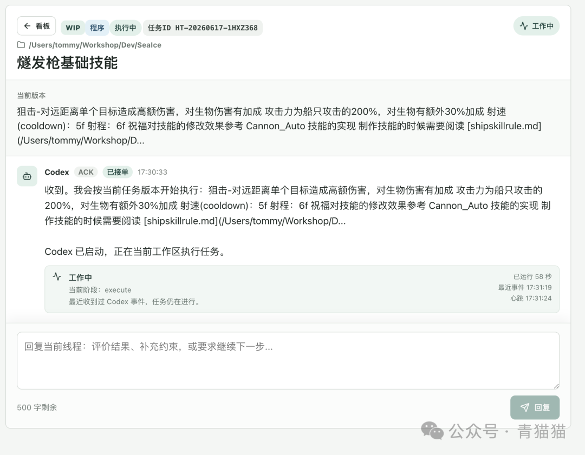
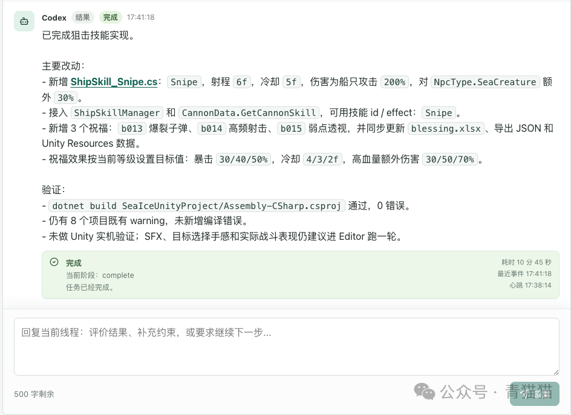
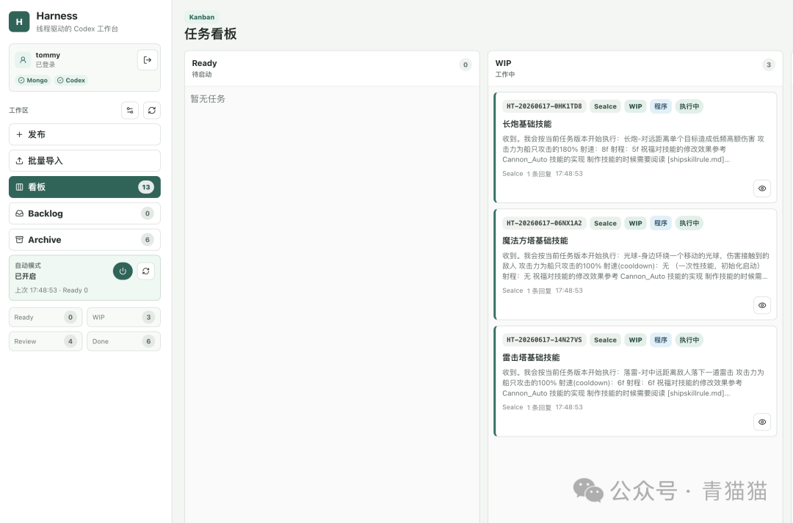
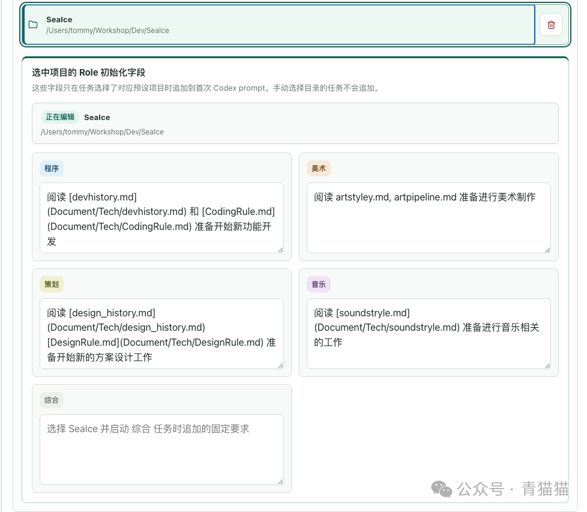
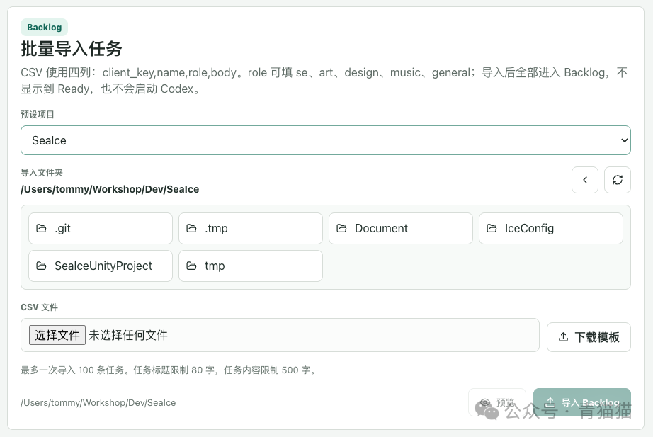

# Codex Kanban Web UI

> 把 Codex 线程变成可管理、可回复、可观察、可批量推进的工作流。

> 当前版本为 `0.1.0-alpha`。这是一个独立开源项目，不是 OpenAI 官方产品，也不代表 OpenAI。Codex 是 OpenAI 的产品与商标。


## 项目是什么

当 Agent 开始接管越来越多具体工作，问题就不再只是“它能不能完成任务”，而是人应该如何组织、检查、恢复和批量推进这些工作。

Codex 是通用的执行 Agent，不是项目管理系统。它可以在一个线程中完成复杂任务，但大量工作长期散落在对话列表里后，会出现三个问题：

1. 任务要求、关键结果和修改过程分散，难以集中梳理。
2. 已经验证过的工作仍然依赖人工逐个创建、启动和跟进。
3. 工作目录、开发规范和角色约束依赖人记忆，难以稳定复用。

Codex Kanban Web UI 在 Codex 外面增加一层本地 Web 工作台。具体执行仍由本机 Codex 完成，Web UI 负责组织任务、触发执行、保存过程、展示状态和承接人工检查。

## 核心模型

Harness 的最上层不是独立的“项目管理项目”，而是 Thread：

- `Thread`：一项任务、一张工作卡片，以及对应的 Codex 线程。
- `Post`：任务描述、用户回复、Codex ACK 和 Codex 结果。
- `Task`：当前结构化任务版本。
- `Run`：一次真实的 Codex 执行轮次。
- `Event`：执行过程中的状态与活动记录。

预设项目只是本地工作目录的别名，并承载该目录下不同 Role 的初始化要求。它不会改变 `Thread -> Posts -> Task -> Runs -> Events` 的底层关系。

## 设计一：用任务卡片代替无边界聊天

Harness 将每项工作约束为一张短任务卡片。任务在发布时进入 Ready，并绑定一个本地工作目录；真正进入 WIP 后才创建或继续对应的 Codex 工作线程。

这种方式让一项工作具备明确边界：

- 标题说明要解决的问题。
- 正文保存当前任务要求。
- Task ID 作为稳定的业务索引。
- Role 和预设项目决定首次启动时需要附加的工作约定。
- 任务状态和 Codex 执行状态分别记录，不互相覆盖。

## 设计二：用回复流保存任务演进

Codex 的 ACK、执行状态和最终结果都显示在任务卡片内部，而不是散落到独立的日志或 artifacts 区域。



Codex 完成后，结果会成为同一任务中的一条回帖。人工检查时可以直接回复评价、补充约束或提出修改意见。下一次执行会继续对应的 Codex 线程，但不会重复注入只应在首次执行时使用的初始化 Prompt。



相比持续滚动的聊天窗口，这种类似 Feeds 的结构更适合长期保存工作上下文，也给 CLI/API 查询、后续批量处理和跨线程总结提供了结构化基础。

## 设计三：Kanban 同时是管理界面和操作界面

看板使用四个阶段：

- `Ready`：已经进入当前工作面，等待启动。
- `WIP`：已经确认交给 Codex，正在排队或执行。
- `Review`：Codex 已交付，等待人工检查。
- `Done`：人工确认通过。

拖动卡片不仅改变展示位置，也代表真实操作。Ready 拖入 WIP 后，系统才会启动 queued run；Codex 完成后自动进入 Review；检查不通过时，先回复修改意见，再让卡片重新进入 WIP。

Backlog 和 Archive 不占用看板列。Backlog 浏览全部 Ready 任务，Archive 浏览全部 Done 任务；看板只保留当前需要关注的工作面，避免大量待办和历史任务淹没 WIP 与 Review。

## 设计四：让已经验证的工作自动循环

自动模式开启时会立即检查一次当前 Ready 栏，之后再按设置的时间间隔循环检查。当 WIP 低于并发上限时，Harness 自动领取 queued 任务并启动 Codex，直到 WIP 达到上限或 Ready 为空。



检查间隔可以设置为 1 到 10 分钟，同时工作的任务数可以设置为 1 到 5。自动模式只消费 Ready 栏，不会直接扫描 Backlog 全量，因此人仍然控制哪些任务进入当前批次。

这套机制适合处理已经验证过、边界清楚、可以批量推进的工作。第一次探索性工作仍然更适合直接在 Codex 中对话。

## 预设项目与 Agent Role

预设项目把一个名称绑定到本地工作目录。发布任务或批量导入时选择预设项目，Harness 就会把对应目录传给 Codex，并在首次执行时根据 Role 加入项目级初始化字段。



当前支持以下 Role：

| Role | 典型用途 |
| --- | --- |
| `se` | 程序开发与工程任务 |
| `art` | 美术资产与风格工作 |
| `design` | 策划和产品设计 |
| `music` | 音乐与声音工作 |
| `general` | 跨领域或综合任务 |

例如，程序任务可以在首次启动前要求 Codex 阅读工程规范，美术任务可以要求读取风格和资产管线文档。手动选择目录而不绑定预设项目时，不会追加项目级 Role Prompt。

## 批量任务与 Agent 接入

大量 User Story 可以通过 CSV 导入 Backlog。一次导入选择一个工作目录或预设项目，预览通过后批量创建任务，但不会直接启动 Codex。



Harness 也提供 CLI 和 Bearer Token API，其他 Agent 可以完成以下闭环：

- 创建或批量导入任务。
- 查询任务列表和单项详情。
- 把任务启动到 WIP。
- 在原线程中继续回复。
- 查询 heartbeat 和运行状态。

完整命令和数据协议见 [CLI Agent 协议](cli-agent.md)。

## 一次完整工作流

```text
发布 / 导入
    |
    v
Backlog --选择当前批次--> Ready
                              |
                     人工拖动或自动领取
                              |
                              v
                             WIP
                              |
                       Codex app-server
                              |
                              v
                           Review
                         /        \
              回复修改意见          人工通过
                    |                 |
                    v                 v
                  Ready              Done
                                       |
                                    Archive
```

执行过程中，Harness 持续记录最近事件、heartbeat、运行时长和完成耗时。长任务不会因为固定 wall-clock timeout 被自动判定失败；任务结束以 Codex 的 `turn/completed` 为准。

## 技术结构

当前实现由以下部分组成：

- React + Vite：本地 Web 工作台。
- Fastify：认证、任务、看板、设置、CLI API 和 SSE。
- MongoDB：保存账户、线程、帖子、任务、运行、事件和设置。
- Codex app-server：启动或继续真实 Codex thread/turn。
- 本地 worker：并发调度、运行恢复、日志和状态持久化。

详细的数据模型、状态机和 API 见 [技术架构](technical-architecture.md)。产品决策和交互约束见 [设计概览](design-overview.md)。

## 适合与不适合

适合：

- 已经可以拆成明确卡片的开发、内容和资产任务。
- 需要人工 Review，但希望执行阶段自动并行推进的工作。
- 需要保留 Codex 过程和结果，方便后续查询与继续执行的工作。
- 希望让其他 Agent 通过 CLI 批量创建任务的本地流程。

当前版本不适合：

- 需要完整多人协作、组织权限和云端托管的团队项目管理。
- 没有明确验收边界、需要持续开放式探索的任务。
- 希望 Harness 自动完成跨任务总结、规格拆解和外部通知的场景；这些尚未作为内置功能发布。

## 当前状态

`0.1.0-alpha` 已经跑通真实闭环：发布、排队、Codex 执行、状态观察、结果回帖、人工 Review、继续回复、自动模式、批量导入和 CLI 接入。

项目当前以 macOS 本地单用户环境为主要目标。开始安装前请阅读根目录 [README](../README.md)；公网或远程暴露前，务必启用登录并增加 SSH、VPN 或零信任网络边界。
