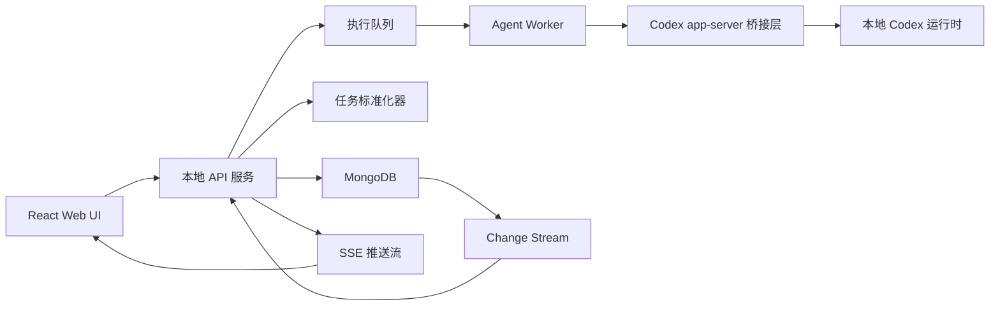

# Tweet-Native AI Harness 技术架构

## 1. 技术目标

构建一个本地优先的 Web 应用，使其满足以下能力：

- 用户在 Kanban 看板发布新任务，也就是创建新线程
- 每个线程都是一个任务和一张工作卡片
- 工作卡片通过 Ready / WIP / Review / Done 管理真实人工阶段，Backlog / Archive 作为 Ready / Done 的全量浏览入口
- 每条用户回复或 Agent 回复都会持久化到数据库
- 系统把线程回复流转换为可执行任务
- 本地 Agent Runtime 调用 Codex 干活
- Codex 的结果以线程内回帖的形式返回
- 前端能近实时地看到回复、状态和 heartbeat 变化

这个架构需要同时支持异步执行、线程隔离、明确的任务状态，以及可靠的本地持久化。

## 2. 建议的最小可用版本技术栈

既然主数据库确定采用 `MongoDB`，本地最小可用版本采用下面这套组合：

- 前端：`React + Vite`
- API 服务：`Fastify`
- 数据库：`MongoDB`
- 数据访问层：`MongoDB Node.js Driver` + `Zod`
- 实时推送：`Server-Sent Events`
- 后台执行：进程内 worker loop，或独立的本地 worker 进程
- Agent Bridge：一个本地 Node 包装层，用来拉起 Codex app-server 会话

这里不优先推荐 ODM，是因为这套系统更像“执行账本 + 事件流”，直接用官方驱动会更容易精确控制事务边界、索引策略和追加写入。

## 3. MongoDB 作为主数据库的基线方案

### 3.1 明确前提

这份技术方案以 `MongoDB` 作为主数据库为前提，不再以 `SQLite` 作为默认推荐。

### 3.2 为什么这套产品也可以很好地用 MongoDB

这个系统虽然有明显的状态流转，但它同样具有很强的文档特征：

- task spec 会持续变化
- context refs 结构不固定
- 不同类型的回帖 payload 差异较大
- run 和 event metadata 很容易演进
- memory 和任务历史天然更接近 JSON 文档

因此，只要集合设计收得住，`MongoDB` 完全可以承载这个系统。

### 3.3 需要先接受的工程约束

如果主库使用 `MongoDB`，建议在文档里先把这些前提写死：

- 本地运行时需要一个单独的 MongoDB 进程或 Docker 容器
- 为了支持事务和 change streams，本地 MongoDB 建议以“单节点副本集”方式运行
- 不要把整个 thread 的全部 posts、runs、events 嵌进一个文档里
- append-heavy 的对象要拆成独立集合，避免文档无限增长

也就是说，虽然数据库选用文档库，但建模方式不能走“万物嵌套进一个大 JSON”那条路。

## 4. 核心技术对象

这个系统最重要的建模原则，是把“用户可见消息层”和“内部执行层”拆开。

### 4.1 `thread`

保存任务的顶层工作边界和聚合视图。

在当前设计里：

- `thread` 是系统最上层对象
- 一个 `thread` 对应一个任务
- 一个 `thread` 在前端表现为一张工作卡片
- `thread.boardStage` 表示看板阶段，独立于执行状态
- `thread.folder` 是该任务的本地工作目录，也是 Codex run 的默认 `cwd`

### 4.2 `post`

保存 thread 中用户和 Agent 可见的消息。

每条关键 post 都可以带状态字段，因为每条回复都代表当前任务的一次状态推进。

### 4.3 `task`

保存由 thread 回复流标准化得到的结构化工作对象。

### 4.4 `run`

保存某个 task 的一次实际执行尝试。

### 4.5 `event`

保存系统内部执行事件，即使它们不一定变成公开回帖。

之所以要这样拆开，是因为：

- 不是每个内部事件都应该暴露给用户
- 不是每条公开回帖都应该作为真实执行状态的唯一来源
- 不同对象的生命周期和写入频率差异很大
- 线程、回复、任务、run 和 event 的边界必须清楚，否则前端会混淆“发布新任务”和“继续回复”

## 5. 高层架构

这张图里最重要的关系是：

- 所有公开消息和内部事件都先进入 `MongoDB`
- API 服务可以基于 change stream 或应用内事件总线，把更新推到前端
- Codex app-server 是底层 thread/turn runtime，不是 Harness 的项目或任务数据库

## 6. 运行流程

### 6.1 用户发布任务 / 新建线程

前端发送：

- 线程名称
- 任务 Role：`se | art | design | music | general`
- 本地线程文件夹；前端可以由设置中的预设项目带入目录，但 API 最终仍接收实际 folder 路径，并可接收 `presetProjectId`
- 根任务 post 文本
- 可选附件
- 可选上下文引用

API 服务负责：

- 校验本地路径是否存在、是否可作为 Codex 工作目录
- 创建 thread 文档
- 插入根任务 post
- 创建 task 文档
- 保存第一版标准化快照
- 创建 queued run
- 设置 `thread.boardStage=ready`
- 设置 `thread.boardDisplay=auto`

这一段推荐放在同一个事务里执行。

创建成功后，卡片进入 Ready，不自动启动 Codex。Ready 栏是 `boardStage=ready` 的显示子集，默认显示最近 10 条和手动显示项；Backlog 入口显示全部 Ready。用户把 Ready 卡片拖入 WIP 并确认后，API 再把当前 queued run 加入执行队列。

自动模式开启后，后端每 5 分钟检查一次 Ready 栏快照。当 WIP 线程数小于 5 时，系统从当前 Ready 栏中选取可启动的 queued run 补入 WIP，最多补到 WIP=5。这里的输入边界是 Ready 栏快照，不是 Backlog 全量；同一轮检查不会因为 Backlog 中下一批任务被自动显示而继续消费整个 Backlog。worker 默认最多并发执行 5 个 Codex run，`CODEX_WORKER_CONCURRENCY` 可以下调并发，但上限固定为 5。

### 6.2 Ready 到 WIP 启动执行

前端把卡片拖入 WIP 时调用 `PATCH /api/threads/:id/board-stage`。

服务端负责：

- 校验目标阶段是合法的 Kanban 阶段
- 校验当前 run 是 `queued`
- 将 `thread.boardStage` 更新为 `wip`
- 将对应 run 加入 worker 队列

服务启动或热重载时，worker 会扫描已经处于 WIP 且当前 run 仍为 `queued` 的卡片，并重新加入执行队列，避免内存队列丢失后卡片长期停留在“未开始”。

如果卡片已经在 Review 或 Done，但没有新的用户回复生成 queued run，则返回冲突错误，提示用户先在单卡片内回复修改意见。

### 6.3 系统生成合并 `ack`

Worker 应该尽快产出一条接单确认，并把“已启动执行”这类初始进展合并在同一条回帖里。这个 `ack` 可以来自：

- 基于标准化任务的确定性模板
- 或一次非常短的 Codex 调用，只负责生成接单语句

不要在 `ack` 后立刻再生成一条固定模板的 `progress`。`progress` 只用于后续真正有信息增量的里程碑、部分结果或质量控制发现。

这条 `ack` 需要同时写入：

- 一条公开可见的 Agent `post`
- 该 post 对应的阶段状态
- 一次 `task.status` 更新
- 一次 `run.phase` 更新
- 一条可审计的 `event`

### 6.4 Worker 拉起 Codex

Worker 基于以下上下文构建执行输入：

- 当前 task 规格
- 当前 thread 摘要
- 引用的文件或文档
- `thread.folder` 对应的 workspace 路径
- 执行策略
- 期望返回的输出 schema

随后由 Codex 桥接层拉起本地 Codex app-server 会话：

- `thread/start` 使用 `thread.folder` 作为 `cwd`
- `turn/start` 启动初始执行
- 后续用户回复可映射到 `turn/steer` 或同一 thread 下的新 turn
- 用户取消映射到 `turn/interrupt`

### 6.5 Worker 捕获执行事件

Codex 桥接层不应该直接往公开 thread 写内容，而应该先输出结构化内部事件，例如：

- `run_started`
- `tool_used`
- `progress_summary`
- `clarification_needed`
- `run_completed`
- `run_failed`

再由编排层决定每个事件应该变成：

- 用户可见回帖
- 静默系统事件
- 仅状态更新

### 6.6 状态与 heartbeat 展示

状态需要同时支持两个层次：

- `thread.boardStage`：Kanban 人工流转阶段
- `thread.role` / `task.role`：任务角色分类，用于看板展示、筛选和后续执行分派
- `thread.status`：当前线程的聚合状态
- `post.status` 或 `post.statusSnapshot`：每条关键回复对应的状态快照

对于未完成任务，前端定时调用 `GET /api/tasks/:id/heartbeat`。这个接口不代表任务结束，只返回当前 run 的可观测状态，例如：

- `working`
- `long_running`
- `stale`
- `completed`
- `failed`
- `cancelled`

其中 `long_running` 和 `stale` 只影响 UI 提示，不应该自动杀掉 Codex 任务。

前端状态块应根据 `run.startedAt`、`run.endedAt` 和 heartbeat 返回值展示时间：

- run 未结束时显示动态“已运行”
- run 完成、失败或取消后显示固定“耗时”
- 这些时间信息跟随对应 Codex 回帖展示，不放在 thread 顶部大块面板里

### 6.7 用户在当前线程继续回复

当用户评价 Codex 回复、补充约束或要求继续做下一步时，前端发送：

- `threadId`
- reply 文本
- 可选附件或引用

API 服务负责：

- 插入用户 reply post
- 给该 reply 记录触发状态，例如 `queued`
- 更新当前 task version
- 复用同一个 thread 和 Codex 会话上下文
- 创建新的 queued run，而不是创建新 thread
- 将卡片放回 Ready，等待用户拖入 WIP 后启动

### 6.8 Worker 写回最终结果

Codex 的最终返回内容应直接写成公开 `result` 回帖。即使结果较长，也优先保持在回复流中，避免用户需要在回帖和单独 artifacts 区域之间切换。

成功完成后，worker 将 `run.status=completed`、`thread.status=delivered`，并把 `thread.boardStage` 自动切到 Review。人工确认通过只更新 `boardStage=done`，不改写 run 的完成事实。失败时卡片保持 WIP，等待用户补充后重新启动。

## 7. 建议的集合设计

虽然数据库是 `MongoDB`，但仍然建议采用“多集合、轻引用、少嵌套”的模型。

不建议：

- 一个 thread 文档里嵌入全部 posts
- 一个 task 文档里嵌入全部 runs 和 events
- 把整个执行历史堆进一条大文档

建议把主要对象拆成独立集合。

### 7.0 `accounts`

用途：

- 保存可以登录 Harness 的本地账户
- 当前阶段只需要单管理员账户，但集合设计保留后续扩展空间

建议字段：

- `_id`
- `username`
- `passwordHash`
- `role`
- `status`
- `lastLoginAt`
- `passwordUpdatedAt`
- `createdAt`
- `updatedAt`

建议索引：

- `{ username: 1 }`，唯一索引
- `{ status: 1, updatedAt: -1 }`

说明：

- 登录校验以 `accounts` 集合为准
- `.env` 里的 `HARNESS_AUTH_USERNAME` 和密码哈希只作为启动 bootstrap / 恢复管理员密码使用
- 服务启动时如果配置了 bootstrap 密码，会 upsert 对应管理员账户

### 7.1 `threads`

用途：

- 保存线程聚合视图、任务入口信息和当前状态

建议字段：

- `_id`
- `publicTaskId`
- `name`
- `folder`
- `status`
- `boardStage`
- `boardDisplay`
- `currentTaskId`
- `currentVersionText`
- `latestAgentPostId`
- `lastEventAt`
- `lastHeartbeatAt`
- `lastActivityAt`
- `createdAt`
- `updatedAt`

建议索引：

- `{ folder: 1, lastActivityAt: -1 }`
- `{ publicTaskId: 1 }` unique
- `{ boardStage: 1, lastActivityAt: -1 }`
- `{ status: 1, lastActivityAt: -1 }`

说明：

- `publicTaskId` 是 Harness 自定义的业务任务号，用于 UI 展示、MongoDB 查询和 API 定位；不要直接暴露或依赖 Mongo `_id`
- `threads` 是 Kanban / Backlog / Archive 的一级数据源
- 每条 thread 对应一个任务和一张工作卡片
- `folder` 是该 thread 下 Codex run 的默认 `cwd`
- `currentTaskId` 是内部 ObjectId 引用，用于关联 `tasks/runs/task_versions/events`
- 不负责保存完整消息历史

### 7.2 `posts`

用途：

- 保存所有用户和 Agent 的公开消息

建议字段：

- `_id`
- `threadId`
- `parentPostId`
- `authorType`
- `authorId`
- `postType`
- `replyType`
- `body`
- `bodyMarkdown`
- `status`
- `statusSnapshot`
- `runId`
- `refs`
- `visibility`
- `createdAt`

建议索引：

- `{ threadId: 1, createdAt: 1 }`
- `{ parentPostId: 1, createdAt: 1 }`
- `{ runId: 1, createdAt: 1 }`
- `{ authorType: 1, createdAt: -1 }`

说明：

- `posts` 是 append-heavy 集合，必须独立出来
- 不要把它嵌在 `threads` 文档里
- 状态跟随回复流展示时，`statusSnapshot` 可以保存当时的任务/运行状态

### 7.3 `tasks`

用途：

- 保存标准化后的工作对象和当前执行态

建议字段：

- `_id`
- `threadId`
- `rootPostId`
- `intent`
- `taskSpec`
- `constraints`
- `status`
- `priority`
- `deadlineAt`
- `assignedAgent`
- `currentRunId`
- `currentVersionId`
- `createdAt`
- `updatedAt`

建议索引：

- `{ threadId: 1 }`
- `{ status: 1, updatedAt: -1 }`
- `{ assignedAgent: 1, status: 1 }`

说明：

- `tasks` 保存“当前有效任务定义”
- 历史版本不要直接覆盖丢失，应放入 `task_versions`

### 7.4 `task_versions`

用途：

- 保存 thread 中滚动演进的规格版本

建议字段：

- `_id`
- `taskId`
- `sourcePostId`
- `versionNumber`
- `summaryText`
- `spec`
- `createdAt`

建议索引：

- `{ taskId: 1, versionNumber: -1 }`
- `{ sourcePostId: 1 }`

说明：

- “当前版本”区域来自这里
- `tasks.currentVersionId` 指向最新版本

### 7.5 `runs`

用途：

- 记录某个 task 的一次执行过程

建议字段：

- `_id`
- `taskId`
- `threadId`
- `triggerPostId`
- `agentName`
- `status`
- `phase`
- `startedAt`
- `endedAt`
- `lastEventAt`
- `lastHeartbeatAt`
- `exitReason`
- `pid`
- `codexSessionRef`
- `sessionLogPath`
- `cancelRequestedAt`
- `metadata`

建议索引：

- `{ taskId: 1, startedAt: -1 }`
- `{ threadId: 1, startedAt: -1 }`
- `{ triggerPostId: 1 }`
- `{ status: 1, lastEventAt: -1 }`

说明：

- `runs` 是执行轮次，不是用户可见消息
- 一个 task 可以对应多个 run
- `triggerPostId` 用来把一次执行和触发它的用户回复关联起来
- 长任务不应该因为固定 wall-clock 超时自动失败；`lastEventAt` 和 `lastHeartbeatAt` 用来支撑可观测状态

### 7.6 `events`

用途：

- 作为追加写入的内部执行账本

建议字段：

- `_id`
- `runId`
- `threadId`
- `taskId`
- `eventType`
- `payload`
- `createdAt`

建议索引：

- `{ runId: 1, createdAt: 1 }`
- `{ threadId: 1, createdAt: 1 }`
- `{ taskId: 1, createdAt: 1 }`

说明：

- `events` 可以非常多，必须单独集合
- 后续可以按时间归档，但不要删掉关键审计事件

### 7.7 `context_refs`

用途：

- 保存 post 或 task 关联的外部上下文引用

建议字段：

- `_id`
- `threadId`
- `postId`
- `taskId`
- `refType`
- `refValue`
- `metadata`
- `createdAt`

建议索引：

- `{ threadId: 1, createdAt: -1 }`
- `{ taskId: 1, createdAt: -1 }`
- `{ postId: 1, createdAt: -1 }`

例如：

- 文件路径
- URL
- 之前的 thread id
- workspace 引用

## 8. 文档建模规则

为了让 `MongoDB` 方案长期可维护，建议把以下规则写成明确约束。

### 8.1 只在当前视图层做轻度冗余

例如：

- `threads.currentVersionText`
- `threads.latestAgentPostId`
- `threads.lastHeartbeatAt`
- `tasks.currentRunId`

这些字段的目的是减少读时拼装成本，而不是替代真实源数据。

### 8.2 不把无限增长的数据嵌套进父文档

以下对象都不适合嵌套数组长期存放：

- posts
- runs
- events

原因包括：

- MongoDB 单文档有大小上限
- append-heavy 文档会频繁重写
- 热文档会成为写入瓶颈

### 8.3 用引用，不用深层嵌套

核心对象之间建议以 ObjectId 引用关联：

- `posts.threadId`
- `tasks.threadId`
- `runs.taskId`
- `events.runId`
- `events.threadId`

这样索引和生命周期都更清晰。

对用户可见的任务定位不要使用 ObjectId。`threads.publicTaskId` 是业务层任务 ID，格式由 Harness 生成并通过唯一索引保证不重复；API 中的 `:id` 可以接收 Mongo `_id` 或 `publicTaskId`，但 UI 应优先展示 `publicTaskId`。

### 8.4 事务只用于关键写路径

推荐放进事务的场景：

- 创建 thread + root post + task + 初始 task_version
- 发布任务时创建 queued run 并设置 `boardStage=ready`
- Agent 合并 `ack` 同时更新 post、task、run、event
- 用户回复触发新 run 时，同时写入 post、task_version、run
- Kanban 阶段切换时同时写入 `threads` 和审计 `events`
- 任务取消时的状态一致性更新

不要把所有普通写入都放进事务，否则复杂度和锁开销会增大。

## 9. 建议的状态机

状态机仍然要尽量小而清晰。

推荐的 `task.status`：

- `queued`
- `accepted`
- `researching`
- `running`
- `waiting_for_input`
- `delivered`
- `failed`
- `cancelled`

推荐的 `run.phase`：

- `normalize`
- `ack`
- `execute`
- `question`
- `deliver`
- `complete`

推荐的 `post.status`：

- `submitted`
- `queued`
- `accepted`
- `working`
- `long_running`
- `waiting_for_input`
- `completed`
- `failed`
- `cancelled`

前端应该直接渲染这些状态，而不是试图从自然语言里反推状态。

推荐的 `thread.boardStage`：

- `ready`
- `wip`
- `review`
- `done`

`boardStage` 只表达人工任务管理阶段，不替代 `run.status`。Kanban 主视图只渲染 Ready / WIP / Review / Done；Backlog / Archive 通过独立入口浏览。Ready/Done 的显示子集由 `thread.boardDisplay=auto|shown|hidden` 控制。

推荐的 `thread.role` / `task.role`：

- `se`：程序
- `art`：美术
- `design`：策划
- `music`：音乐
- `general`：综合

## 10. API 设计草图

API 需要把“公开发帖”和“内部执行”分离。

当前主要接口：

- `GET /api/auth/me`
- `POST /api/auth/login`
- `POST /api/auth/logout`
- `POST /api/threads`
- `GET /api/threads`
- `GET /api/threads/:id`
- `PATCH /api/threads/:id/board-stage`
- `PATCH /api/threads/:id/board-display`
- `GET /api/board-automation`
- `PATCH /api/board-automation`
- `POST /api/board-automation/check`
- `GET /api/local-directories`
- `GET /api/local-files/:threadId/*`
- `GET /api/threads/:id/stream`
- `POST /api/threads/:id/replies`
- `GET /api/tasks/:id/heartbeat`
- `GET /api/health`

其中：

- `GET /api/auth/me` 返回登录开关和当前会话状态
- `POST /api/auth/login` 用本地账户和访问密码换取 HttpOnly 会话 Cookie
- `POST /api/auth/logout` 清除当前会话 Cookie
- `POST /api/threads` 是发布任务 / 新建线程，生成唯一 `publicTaskId`，创建 queued run，并设置 `boardStage=ready`
- `GET /api/settings` / `PATCH /api/settings` 持久化工作台设置，其中 `systemPrompt` 保存线程初始化基础 Prompt，`presetProjects` 保存常用工作区目录别名和项目级 Role 初始化字段；它不创建 Harness 项目实体
- `GET /api/threads/:id` 的 `:id` 可以是 Mongo `_id` 或 `threads.publicTaskId`
- `PATCH /api/threads/:id/board-stage` 是 Kanban 阶段流转，`:id` 可以是 Mongo `_id` 或 `publicTaskId`，拖入 WIP 时启动 queued run
- `PATCH /api/threads/:id/board-display` 是 Ready/Done 看板栏显示偏好，保存 `auto|shown|hidden`
- `GET /api/board-automation` 返回自动模式开关、WIP 上限、检查间隔、Ready 栏数量、WIP 数量和最近检查结果
- `PATCH /api/board-automation` 只切换自动模式开关，自动模式配置持久化在 MongoDB `board_automation` 集合
- `POST /api/board-automation/check` 手动触发一次自动模式检查；如果 WIP 已达到上限或 Ready 栏为空，不会启动新的 Codex run
- `POST /api/threads/:id/replies` 是回复当前线程，`:id` 可以是 Mongo `_id` 或 `publicTaskId`，创建新的 queued run，但不自动启动
- `GET /api/tasks/:id/heartbeat` 是未完成任务的可观测状态查询，`:id` 可以是内部 task ObjectId 或 `publicTaskId`；对外使用优先传 `publicTaskId`
- `GET /api/local-files/:threadId/*` 将线程目录内的本地文件安全代理为同域可点击链接
- `GET /api/threads/:id/stream` 是当前线程的 SSE 事件流，`:id` 可以是 Mongo `_id` 或 `publicTaskId`
- `POST /api/threads/:id/posts` 旧入口已移除；当前只保留发布任务的 `POST /api/threads` 和追加回复的 `POST /api/threads/:id/replies`

后续可补的接口：

- `GET /api/tasks/:id`
- `POST /api/tasks/:id/runs`
- `POST /api/tasks/:id/cancel`

`/api/threads/:id/stream` 用 SSE 推送：

- 新回帖
- 状态变化
- run 完成通知

前端展示约束：

- 默认工作区显示 Ready / WIP / Review / Done 看板
- 发布任务保留弹窗入口；设置、批量导入、Backlog 和 Archive 通过左侧导航切换为右侧主体页面
- Backlog / Archive 不显示为 Kanban 列，通过左侧导航打开右侧主体页面浏览
- Backlog 显示所有 Ready，Archive 显示所有 Done，包括已经显示在 Ready/Done 栏中的任务
- Kanban 卡片和任务库卡片显示 `thread.presetProjectId` 对应的预设项目
- “发布任务 / 新建线程”创建新的 queued run，状态进入 Ready
- 拖入 WIP 前弹出确认，确认后才启动 Codex
- 点击卡片进入单卡片线程工作区
- 单卡片底部回复栏只追加到当前 thread，并等待再次拖入 WIP
- 运行计时、完成耗时、heartbeat、最近事件和完成状态跟随对应的 Codex 回帖展示，不在 thread 顶部放大块状态面板

## 11. Codex 集成设计

Codex 桥接层是应用与本地 Agent Runtime 之间最关键的边界。

### 11.1 桥接层的职责

- 拉起本地 Codex app-server
- 传入 `thread.folder` 作为 workspace 路径
- 捕获 stdout、stderr、exit code、session 引用
- 把原始输出转换成结构化运行时事件
- 处理握手 RPC 超时、无事件 watchdog 和用户取消

### 11.2 不要让 Codex 直接写数据库

桥接层应该把结构化结果交回 worker，再由 worker 负责：

- 决定哪些内容变成公开回帖
- 更新任务状态
- 处理重试逻辑

这样即使 Codex 输出比较噪，也不会破坏应用状态的一致性。

### 11.3 回帖生成策略

推荐采用两段式：

1. Codex 先输出内部结构化结果。
2. Orchestrator 再把这些结果转换成公开 thread 回帖。

这样更容易抑制低价值 chatter。

## 12. 实时前端策略

对这套 MongoDB 架构来说，`Server-Sent Events` 依然是最合适的第一步。

建议两种做法：

### 12.1 第一版

- API 在写入成功后，直接向 SSE 订阅者推送应用内事件

优点：

- 简单
- 易于调试
- 不依赖数据库 change stream

### 12.2 第二版

- API 服务订阅 MongoDB change stream
- 把 `posts`、`tasks`、`runs`、`events` 的变更推到 SSE

优点：

- 更接近数据库真实状态
- 多进程 worker 下更稳

前提：

- MongoDB 必须以副本集方式运行

## 13. 搜索与 Memory

第一版不要把 memory 做得太重。

本地最小可用版本先这样做就够了：

- `posts.body` 建 `text index`
- `threads.name` 和 `threads.currentVersionText` 建基础检索索引
- 把 task spec 和 context refs 结构化存储
- 给每个 task version 保存简短 thread 摘要

需要注意：

- MongoDB 内建文本检索对中文不是最强项
- 如果后续中文搜索要求更高，可以再补 `Meilisearch` 或其他专用搜索组件

第一优先级不是“很聪明的 memory”，而是“稳定可执行的 thread”。

## 14. 结果回帖策略

当前产品不设置独立 artifacts 区域。Codex 返回的最终结果直接写入 `result` 回帖。

建议约束：

- 用户输入仍保持 500 字限制
- Agent 输出不套用用户输入限制
- 长回复可以在前端正文区域内滚动展示
- 生成或修改的真实文件仍保存在对应 `thread.folder` 工作目录中，由 Codex 在回复里说明路径

## 15. 安全与隔离

即使是本地应用，也要尽早定义执行边界。

当前已落地的登录边界：

- 默认 API 只监听 `127.0.0.1`
- 设置 `HARNESS_AUTH_PASSWORD` 或 `HARNESS_AUTH_PASSWORD_HASH` 后自动启用登录，账户名来自 `HARNESS_AUTH_USERNAME`
- 登录账号存储在 MongoDB `accounts` 集合；`.env` 只负责首次 seed 或恢复管理员密码
- 启用登录后，除 `/api/auth/*` 之外的 `/api/*` 全部需要会话
- 会话用服务端 HMAC 签名 token，写入 `HttpOnly; SameSite=Lax` Cookie
- SSE `/api/threads/:id/stream` 与普通 API 使用同一套 Cookie 校验
- 登录失败按客户端地址做短窗口限流，默认 5 分钟 8 次
- `SERVER_HOST` 设为公网监听地址时，如果没有启用登录，服务拒绝启动
- HTTPS 或公网反代场景应设置 `HARNESS_COOKIE_SECURE=true`，并提供稳定的 `HARNESS_SESSION_SECRET`

建议加上这些控制：

- 明确的 workspace allowlist
- 区分只读 run 和可写 run
- 支持按 run 取消
- 不给整个 Codex run 设置固定 wall-clock 超时；长任务应该可观测、可取消、可恢复
- 对 initialize、thread/start、turn/start 等握手请求保留短超时
- 对无事件运行状态做 watchdog 提醒，但不静默 kill
- 用 `events` 集合保留审计轨迹

因为这个系统会调用本地 coding agent，所以任务隔离不是可选项。

## 16. 建议的实现顺序

### Phase 1

- 左侧线程导航
- Kanban 任务看板
- 发布任务 / 新建线程入口，发布后进入 Ready
- 拖入 WIP 后确认启动 Codex
- 线程名称、任务 Role 和本地目录选择
- 单卡片线程工作区
- 右侧底部回复输入栏
- MongoDB 集合 schema
- `threads/posts/tasks` 入库
- 简单 task 标准化
- 确定性合并 `ack` 回帖

### Phase 2

- 后台 worker
- Codex app-server 桥接层
- 带类型的回帖生成
- 用户回复继续当前 thread
- 回复级状态、心跳和最近事件
- SSE 实时刷新

### Phase 3

- 当前版本区域
- task versioning
- 搜索
- retry 和 cancel 流程

### Phase 4

- 基于 change stream 的实时同步
- 更丰富的 context refs
- 多 Agent
- thread 级 memory

## 17. 技术总结

既然主库已经确定为 `MongoDB`，那系统稳定性应建立在下面这些原则上：

- `MongoDB` 用多集合建模，而不是大文档嵌套
- 本地 MongoDB 以单节点副本集方式运行
- 关键写路径使用事务
- append-heavy 数据拆成 `posts/runs/events`
- SSE 先跑通，change stream 作为后续增强
- Codex 只产出结构化结果，不直接写数据库

这样做的结果是：既保留了 MongoDB 的文档灵活性，又不会把 thread、post、task、run、event 这些核心对象做散或做乱。
